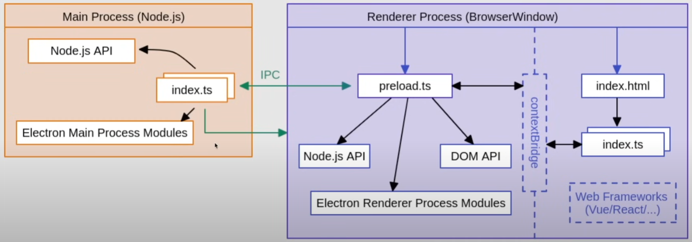

# Markdown-Notes-ElectronJS
Markdown Notes app with Electron, React, Typescript, Tailwind and Jotai.
[Documentation](https://electron-vite.org/)

## Prepare the environment
```console
yarn create @quick-start/electron
```
√ Project name: ... note-mark
√ Select a framework: » react
√ Add TypeScript? ... No / **Yes**
√ Add Electron updater plugin? ... **No** / Yes
√ Enable Electron download mirror proxy? ... **No** / Yes

```console
> cd note-mark
> npm install
```

## Recommended IDE Setup

- [VSCode](https://code.visualstudio.com/) + [ESLint](https://marketplace.visualstudio.com/items?itemName=dbaeumer.vscode-eslint) + [Prettier](https://marketplace.visualstudio.com/items?itemName=esbenp.prettier-vscode)

## Project Setup

### Install

```bash
$ npm install
```

### Development

```bash
$ npm run dev
```

### Build

```bash
# For windows
$ npm run build:win

# For macOS
$ npm run build:mac

# For Linux
$ npm run build:linux
```


## How Electron Works
